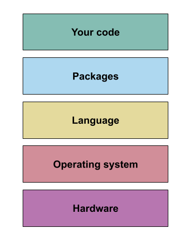

::: questions

- What is computational reproducibility?

:::::

::: objectives

- Learn about computational reproducibility

:::::

## Making your results and code reproducible

You have just finished your latest research project. The paper has been accepted by the journal 
(only minor revisions, yay!), the data is organised and ready to be placed in a repository, and 
your code is under version control and ready to be made public.
So you've done everything to make your results reproducible, right?

::::::::::: discussion

Does simply making your source code publicly available equate to making it reproducible?  
If it doesn't, what do you think can go wrong?

:::::::

::::: solution

1. The code won't run

2. The code runs but doesn't produce the same result

---

[Hardwicke et al. (2018)](https://doi.org/10.1098/rsos.180448)
found that code from approximately one-third of 35 articles in _Cognition_ produced the reported results.

[Obels el al. (2020)](https://doi.org/10.1177/2515245920918872) found that of 36 registered-reports with data
and code available the main results in just over half were computationally reproducible.

::::::

Your code is just the tip of the pyramid of your computational environment, and to ensure that your 
results are computationally reproducible you will need to capture some of that computational environment.

## Your computational environment

A simplified way to think about your computational environment is to divide it into 5 layers, each 
with increasing generality:

1. At the top is the most specific level: **'your code'**. This is the code that you produced to 
analyse your data and get the final published result.  
2. Below this is the **'packages'** layer, containing the packages you used within your code. These 
are also bundles of code, but they serve a more general purpose, being used in multiple different 
pieces of (research) software. For example: `numpy`, `pandas`, etc.  
3. Next is the **'language'** layer. This is the specific programming language and version you used. 
Typically, both your code and the packages you have used are written in this language, and it 
consists of the language syntax as well as some built in packages (in some cases called the 
standard library).  
4. The next layer is the **'operating system'** layer. Which is a very simplified way of encapsulating 
all the code that sits between the programming language you are using, and the actual 
electronic hardware that makes up a computer. 
5. Finally, you have the actual computer hardware.

## What is computational reproducibility?

::::::::: discussion

How would you define computational reproducibility?

:::::::::

::::: solution

A suggested definition:  
Computational reproducibility is the degree to which your code can be run in a different 
computational context (i.e. either by a different person, at a different time, on a different 
machine, or any combination of these three) and will produce the same or equivalent outcome.  

:::::::

What counts as the same or equivalent will vary between research contexts. In some cases precise 
byte-for-byte reproducibility is essential, while in others getting results that fall in the same 
range will be suitable.  

The more layers of your computational environment that you are able to capture (going from the top 
to the bottom layer), the more reproducible your results will be. However, achieving this is accompanied by 
increasing technical complexity, so choosing the right degree of computational reproducibility for 
your project is key.

In the next section we'll look in a bit more detail about package managers, virtual environments, 
and how we can use them in conjunction to capture the 'packages' layer of a computational
environment.

:::: keypoints

 - Typically, simply providing your source code does not allow other to reproduce your work.
 - Computational reproducibility is the degree to which code can be run in a different context.
 - Improving computational reproducibility relies on capturing information about your computational 
 environment.

::::::
