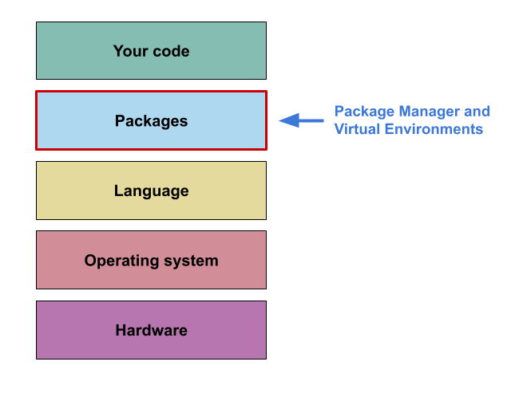
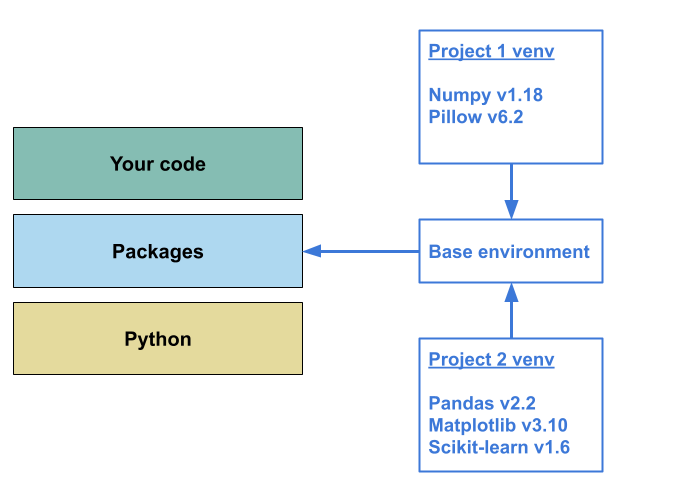
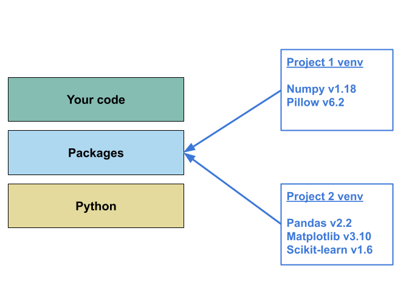

::: questions

- What is a package manager?
- What are virtual environments?
- How can we use them to capture information about a specific computational environment?

:::::

::: objectives

- Develop a basic understanding of what a package manager does
- Develop a conceptual understanding of virtual environments

:::::

Now you have a better idea of the challenges around computational reproducibility let's look at how 
Package Managers and Virtual Environments can be used in conjunction to capture the 'packages' 
layer of your project's computational environment.

## What is a Package and a Package Manager?

As mentioned in the previous section, a package can be broadly defined as a bundle of code that 
is designed to accomplish a specific task.
As the name suggests, a Package Manager is a tool used for adding, remove, upgrade, and keeping 
track of the packages installed for a particular piece of software (including programming 
languages).  
As part of this course we will be using the Python programming language, and so we
will be using Python's built in package manager: `pip`. However, many of the concepts discussed 
apply to other programming languages.

In the context of your code, the packages you install are also known as the dependencies for your 
code (i.e. your code depends on these packages being available to work). The packages you install 
will also have their own dependencies, and these dependencies may have their own dependencies. 
Generally this is not something you need to worry about, because as part of the installation process 
the package manager will work out the dependencies of all the packages that need to be installed 
(a process called _dependency resolution_), and then install them for you.

:::::::::: callout

### For example:

You want to install the `pandas` package, `pip` will check to see which other packages `pandas` needs
and it will see that one of the dependencies of `pandas` is the `numpy` package.  
So when you install `pandas`, `pip` will also install `numpy` for you.  

:::::::::::::::::

Package mangers will also keep track of the specific versions of the packages installed for a 
project, and can produce files allowing this information to be shared. This functionality is a key 
part of capturing a specific computational environment and we'll return to it later.

:::: spoiler

You can learn more about Python packages and how to trun your code into a package in the 
[FAIR4RS Packaging lesson](https://fair2-for-research-software.github.io/FAIR4RS-Packaging/)

::::::

::::::: callout

### Where does pip get packages from?

When you install a package using `pip` it will typically access the [Python Package Index (PyPI)](https://pypi.org/)
to download and install that package.  
PyPI is an online repository of over 500,000 packages, and is the most commonly used source for 
installing Python packages.

It is also possible to install packages from local files, private repositories, or even directly 
from Github repositories, but this is outside the scope of this lesson. 

:::::::

## What are Virtual Environments?

By default when you use `pip` to install a package it will be installed in Python's base 
environment, and so using `pip` alone for multiple projects will result in their dependencies
sharing the same space.  

:::: discussion

Can you think of a few reasons why this may be a problem?

::::::

:::: solution

- Different projects requiring different versions of the same package (Dependency clashes)
    - Could be a package you use directly
    - Could also be a dependency of a package you use
- Difficulty identifying which packages are required for which projects (Isolating dependencies)
:::::::

This diagram illustrates the situation:

1. In this example, 'Project 1' requires `numpy` v1.18 and while 'Project 2' doesn't directly 
require a conflicting version of `numpy`, `pandas` requires at least v1.22. This creates a 
dependency clash - You cannot have both versions of this package installed in the same environment, 
so either:
    - You break the older project's computational environment, or 
    - You cannot develop your new code.  

2. If you manage to resolve the dependency clash, you still have the issue that the additional 
dependencies (namely `pillow`) from 'Project 1' will also be captured as part of the computational 
environment for 'Project 2'. This _may_ not cause any issues, but it is generally not good practice: 
    - When capturing information about the computational environment for a project we only want to 
include exactly what is required for the reproduction of that project.  

Virtual environments are a tool designed to solve both of these problems. Conceptually they work by 
creating a separate, self-contained space to install packages. Because these spaces are isolated 
from one another you are able to install different versions of the same package for different 
projects without creating dependency clashes.
This isolation between projects also allows you to accurately capture which packages were used 
within a specific project, making it easier to recreate that aspect of the computational 
environment in a different context.  
In Python there are several different tools you can use to create and manage virtual environments.
We'll discuss some of the options later, but for this course we'll focus on Python's built in virtual
environment tool: `venv`.

## Capturing the 'packages' level of a computational environment

Now we've described Package Managers and Virtual Environments we can outline the steps required to 
successfully capture the 'packages' layer of a computational environment for a project:

1. Create a virtual environment for your project

2. Develop your project, installing packages into the virtual environment as needed

3. Periodically record the packages installed in the environment, ideally to a file alongside the 
code

In the next section we'll get to grips with using `pip` and `venv`, and then move onto how to 
capture the 'packages' level of a computational environment using them.

:::: keypoints

 - Package Managers are used to install, remove, upgrade, and track software.
 - In the context of Python and other programming languages this software is bundles of other 
 people's code.
 - However, installing all packages to the same place can cause dependency clashes and makes 
 recreating a computational environment difficult. 
 - Virtual environments are used to deal with this problem by creating isolated spaces where 
 packages can be installed without interfering with one another.
 - Using these two tools together allows capture of the 'package' level of your computational 
 environment

::::::
