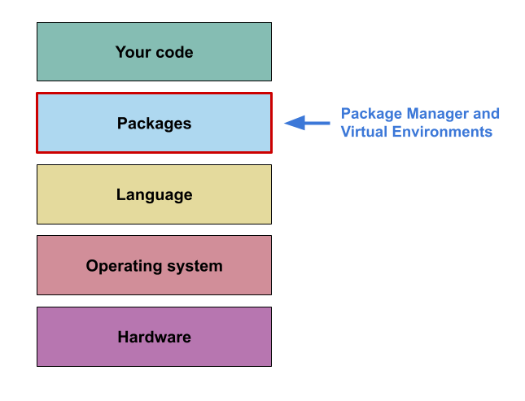

::: questions

- What are the limitations of `venv`?
- What are the limitations of virtual environments more generally?

:::::

::: objectives

- blah

:::::

## Specific limitations of `venv`

While `venv` is a relatively simple option for setting up and managing your virtual environments it 
does have some key limitations:

  1. Python version management
  2. Automatically keeping track of installed packages

### 1. Python version management

There are differences between the different versions of Python. With the most extreme example being 
the incompatibility between Python2 and Python 3.
Depending on the complexity of your code, changes between version may not affect you, but it can be 
hard to tell without trying a newer version.  If you want to make your code truly reproducible you 
should include some information about which version of Python you used to produce your results.  

`venv` uses whichever version(s) of Python you have installed on your machine, but neither `venv` 
or `pip` records information about which version of Python you are using.  

It is, of course, possible to include this information with the instructions on how to run your 
code, but as highlighted multiple times it is better to have an automated solution.

### 2. Automatically keeping track of installed packages

As shown, using `venv` with `pip` can create a list of dependencies for your project, but this has 
to be created manually and updated manually whenever you modify the dependencies for your project.

Ideally this would be updated automatically as packages are added and removed, so as to avoid any 
mistakes or forgetting to update it after changes have been made.

### Solutions

There are quite a few different tools that have been developed to deal with these issues. 
Out of these the ones available, I have found most useful to be 
[`conda`](https://docs.anaconda.com/miniconda/)/
[`miniforge`](https://github.com/conda-forge/miniforge) and 
[`uv`](https://docs.astral.sh/uv/).  
These tools combine package, environment, and Python version management, allowing you to do 
everything that `pip` and `venv` do, while also being able to easily switch between different Python 
versions. Both will also record the version of Python used within an environment allowing you to 
capture both the 'package' and 'language' layers of your computational environment in one go.

There are some differences between them though:  

`conda`/`miniforge`:  
    - Provide pre-compiled binaries for packages  
    - Includes other languages (notably R)  
    - They use their own package repositories, so may not be interoperable with other Python tools 
    without a bit of fiddling  

`uv`:  
    - Uses same package repositories as `pip`  
    - Auto updating of environment dependencies file (equivalent to `requirements.txt`)  
    - Noticably faster for installing pacakges than `pip` or `conda`  
    - Not reached a v1 release yet  

Up until recently I have used `conda` to create and manage my Python environments, however having 
given `uv` a try recently I am considering using it on a more permanent basis.  

## General limitations of virtual environments

Beyond the specific limitations of `venv`, virtual environments in general have one key limitation:

  - They are not able to control the underlying system they are working within.

If we go back to our diagram showing the different layers of your computational environment, you can 
see that virtual environments only address the layer of the environment immediately below your 
code.

If you are using something like `conda`, `miniforge` or `uv`, then you may be able to extand that 
to the 'language' layer. But these tools are not able to capture the 'operating system' layer.

Depending on the degree of computational reproducibility you are looking for capturing the 
'package' and 'language' layers may be enough. However, if you are looking for byte-for-byte 
reproducibility you will likely also want to capture as much of the computational environment as 
possible, and so you will need to turn to other tools

## Capturing the operating system layer

There are multiple different tools that can be used to capture the 

### Containers

Containers are one solution for this.

### Nix/Guix

An alternative is Nix/Guix
